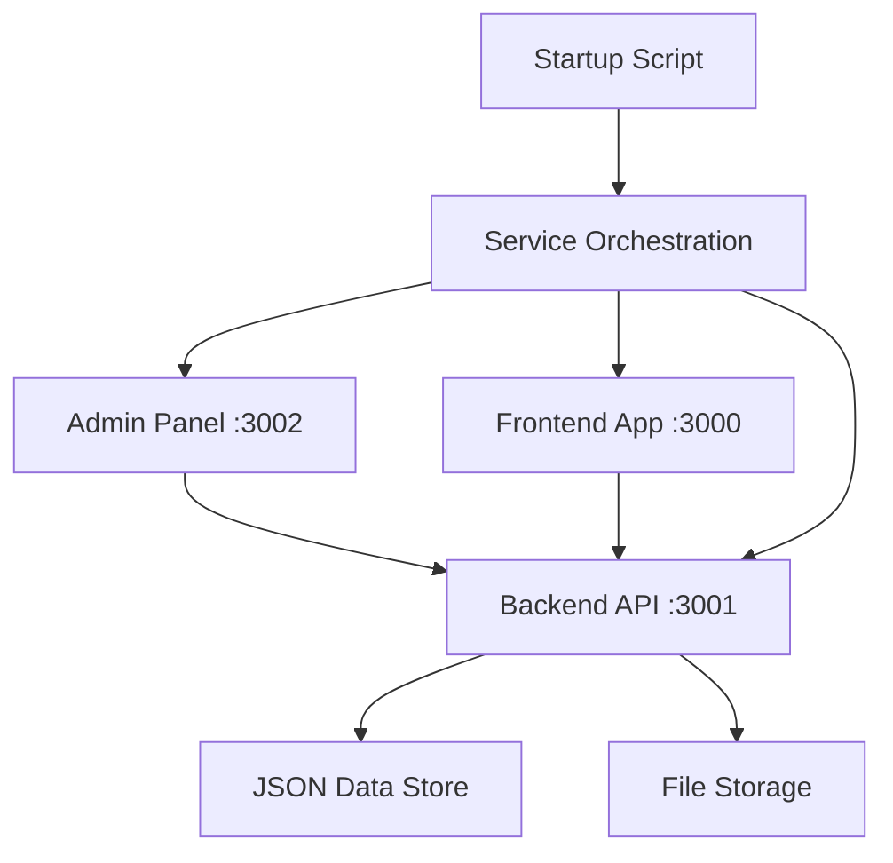
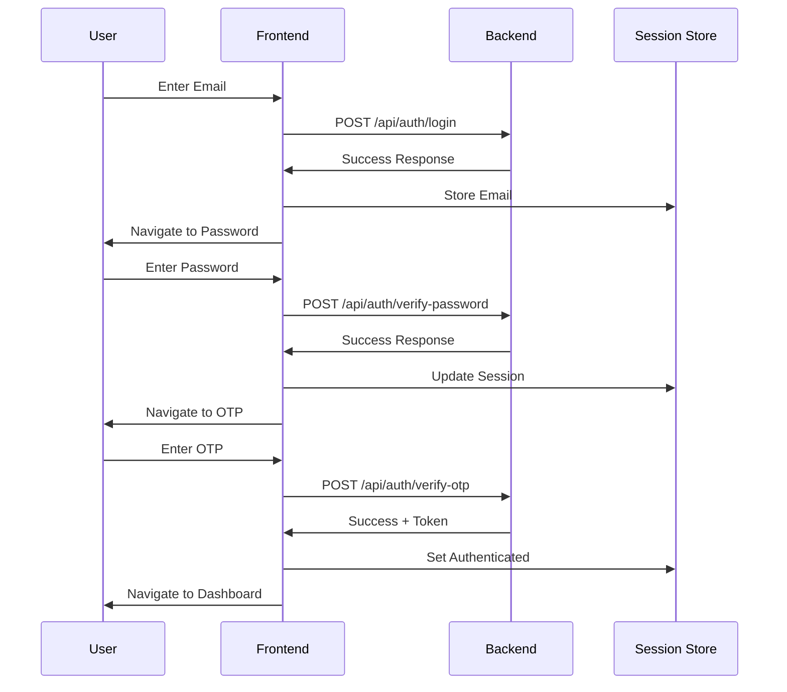

# Design Document

## Overview

This design addresses 11 critical issues in the Amazon Seller Central clone project, a three-tier React/TypeScript application with comprehensive internationalization support. The fixes target data refresh mechanisms, state management, authentication flows, localization systems, and user interface improvements across the Frontend (port 3000), Backend API (port 3001), and Admin Panel (port 3002).

The design follows the existing architectural patterns using React 18, TypeScript, Ant Design, TanStack Query, Zustand state management, and Express.js backend with JSON file storage.

## Architecture

### System Components

The application consists of three main components:

1. **Frontend Application** (React + Vite + Tailwind CSS)
   - Main seller dashboard interface
   - Authentication system with multi-step flow
   - Business reports and analytics
   - Internationalization support (Chinese/English)

2. **Backend API** (Node.js + Express + TypeScript)
   - RESTful API endpoints
   - Authentication and session management
   - Data persistence using JSON files
   - File upload handling with Multer

3. **Admin Panel** (React + Ant Design + TypeScript)
   - User management interface
   - Product management with image uploads
   - Administrative controls
   - Internationalization support

### Data Flow Architecture



## Components and Interfaces

### 1. User Management System Refresh

**Component**: `UserManagement.tsx`
**Issue**: New users not appearing after create/update operations

**Current Implementation Analysis**:
- Uses TanStack Query for data fetching
- Manual `loadUsers()` function called after operations
- No automatic cache invalidation

**Design Solution**:
- Implement automatic query invalidation using TanStack Query's `invalidateQueries`
- Add optimistic updates for immediate UI feedback
- Enhance error handling with rollback mechanisms

**Interface Changes**:
```typescript
interface UserManagementState {
  users: User[];
  loading: boolean;
  error: string | null;
  lastUpdated: Date;
}

interface UserOperationResult {
  success: boolean;
  data?: User;
  error?: string;
  shouldRefresh: boolean;
}
```

### 2. Product Image Upload State Management

**Component**: `ImageUpload.tsx` and `ProductManagement.tsx`
**Issue**: Previous image displayed instead of current upload

**Current Implementation Analysis**:
- Local state `imageUrl` not properly synchronized
- Form state and component state mismatch
- No proper cleanup between product switches

**Design Solution**:
- Implement proper state synchronization between form and component
- Add cleanup effects for component unmounting
- Use React's `useEffect` with proper dependencies
- Implement state reset mechanisms

**Interface Changes**:
```typescript
interface ImageUploadState {
  currentImage: string | null;
  uploadingImage: string | null;
  isUploading: boolean;
  error: string | null;
}

interface ImageUploadProps {
  productId?: string;
  currentImage?: string;
  onImageUploaded: (imageUrl: string) => void;
  onImageRemoved?: () => void;
  onStateReset?: () => void;
  disabled?: boolean;
}
```

### 3. Product Revenue Field Integration

**Components**: `ProductManagement.tsx` and Backend API
**Issue**: Missing revenue field in forms and display

**Design Solution**:
- Add revenue field to product data model
- Update form validation schemas
- Modify API endpoints to handle revenue data
- Update table columns and display components

**Data Model Changes**:
```typescript
interface Product {
  id: string;
  store_id: string;
  title: string;
  sku: string;
  asin: string;
  price: number;
  inventory: number;
  revenue: number; // NEW FIELD
  status: 'Active' | 'Inactive';
  image_url?: string;
  units_sold: number;
  created_at: string;
  updated_at: string;
}
```

### 4. Backend Admin Internationalization

**Components**: Admin Panel components
**Issue**: Missing i18n support in admin interface

**Design Solution**:
- Implement i18n provider for admin panel
- Create translation files for Chinese and English
- Add language switcher component
- Persist language preference in localStorage

**I18n Architecture**:
```typescript
interface AdminI18nConfig {
  defaultLanguage: 'en' | 'zh';
  supportedLanguages: Array<{
    code: 'en' | 'zh';
    name: string;
    flag: string;
  }>;
  translations: Record<string, Record<string, string>>;
}
```

### 5. Frontend Authentication System

**Components**: `AuthPages.tsx` and authentication flow
**Issue**: Login failures in authentication process

**Current Implementation Analysis**:
- API calls to backend authentication endpoints
- Multi-step authentication (email → password → OTP)
- Session state management with Zustand

**Design Solution**:
- Debug and fix API endpoint communication
- Improve error handling and user feedback
- Add proper loading states and validation
- Implement retry mechanisms for failed requests

**Authentication Flow**:


### 6. Menu Localization System

**Component**: `sidebar.config.tsx`
**Issue**: "Manage Store" menu not properly localized

**Design Solution**:
- Update sidebar configuration to use translation keys
- Implement dynamic menu rendering with i18n
- Add proper fallback mechanisms
- Ensure consistent terminology across interface

### 7. Startup Script Process Management

**Component**: `start.bat`
**Issue**: Script not exiting after launching services

**Current Implementation Analysis**:
- Complex service detection and startup logic
- Multiple service orchestration
- Domain server configuration

**Design Solution**:
- Simplify script exit logic
- Add proper process termination
- Implement clean exit after successful startup
- Maintain service monitoring without blocking

### 8. Dynamic Sales Snapshot Timestamps

**Component**: `BusinessReports.tsx`
**Issue**: Static timestamps instead of dynamic ones

**Design Solution**:
- Generate timestamps dynamically on data load
- Update timestamps on data refresh
- Format timestamps according to locale
- Implement real-time timestamp updates

### 9. Year-over-Year Sales Comparison

**Component**: `BusinessReports.tsx`
**Issue**: Improper year-over-year data comparison

**Design Solution**:
- Implement proper date range calculations
- Add year-over-year data fetching logic
- Create comparison chart components
- Handle missing historical data gracefully

### 10. Date Dropdown Interface Improvements

**Component**: `CustomDateDropdown` and `BusinessReports.tsx`
**Issue**: Width and format issues in date dropdowns

**Design Solution**:
- Fix dropdown width calculations
- Standardize date format display
- Improve responsive behavior
- Add proper validation logic

### 11. Date Picker Styling and Validation

**Component**: `DatePicker` and `BusinessReports.tsx`
**Issue**: Styling inconsistencies and validation problems

**Design Solution**:
- Standardize date picker styling with application theme
- Implement comprehensive date validation
- Add proper error messaging
- Handle edge cases (leap years, month boundaries)

## Data Models

### Enhanced Product Model
```typescript
interface Product {
  id: string;
  store_id: string;
  title: string;
  sku: string;
  asin: string;
  price: number;
  inventory: number;
  revenue: number; // Added field
  units_sold: number;
  status: 'Active' | 'Inactive';
  image_url?: string;
  created_at: string;
  updated_at: string;
}
```

### User Management State
```typescript
interface UserManagementState {
  users: User[];
  loading: boolean;
  error: string | null;
  lastUpdated: Date;
  optimisticUpdates: Map<string, User>;
}
```

### Image Upload State
```typescript
interface ImageUploadState {
  currentImage: string | null;
  uploadingImage: string | null;
  isUploading: boolean;
  error: string | null;
  uploadProgress: number;
}
```

### Sales Analytics Data
```typescript
interface SalesSnapshotData {
  totalOrderItems: string;
  unitsOrdered: string;
  orderedProductSales: string;
  avgUnitsPerOrder: string;
  avgSalesPerOrder: string;
  timestamp: string; // Dynamic timestamp
  lastUpdated: Date;
}

interface ChartDataPoint {
  date: string;
  name: string;
  units: number;
  sales: number;
  lastYearUnits: number;
  lastYearSales: number;
}
```

### Internationalization Configuration
```typescript
interface I18nConfig {
  currentLanguage: 'en' | 'zh';
  supportedLanguages: Language[];
  translations: TranslationMap;
  dateFormats: Record<string, string>;
  numberFormats: Record<string, Intl.NumberFormatOptions>;
}
```

Now I'll use the prework tool to analyze the acceptance criteria before writing the correctness properties:

<function_calls>
<invoke name="prework">
<parameter name="featureName">amazon-seller-central-bug-fixes

## Correctness Properties

*A property is a characteristic or behavior that should hold true across all valid executions of a system-essentially, a formal statement about what the system should do. Properties serve as the bridge between human-readable specifications and machine-verifiable correctness guarantees.*

### Property 1: User Management Automatic Refresh
*For any* user management operation (create or update), the user list should automatically refresh and display the updated data without requiring manual page refresh
**Validates: Requirements 1.1, 1.2**

### Property 2: User Management State Preservation
*For any* user management refresh operation, the current page position, filters, and UI state should be preserved
**Validates: Requirements 1.3**

### Property 3: User Management Error Handling
*For any* failed user management refresh operation, an appropriate error message should be displayed to the user
**Validates: Requirements 1.4**

### Property 4: Image Upload State Synchronization
*For any* product image upload operation, the component should immediately display the newly uploaded image and clear any previous image state
**Validates: Requirements 2.1, 2.2**

### Property 5: Image Upload Context Switching
*For any* product context switch, the image upload component should display the correct image for the selected product
**Validates: Requirements 2.3**

### Property 6: Image Upload Error Recovery
*For any* failed image upload operation, the component should revert to the previous valid image state
**Validates: Requirements 2.4**

### Property 7: Revenue Field Validation
*For any* revenue data input, the system should validate it as a positive numeric value and reject invalid inputs
**Validates: Requirements 3.4**

### Property 8: Revenue Data Persistence
*For any* product with revenue data, the backend API should persist the revenue information correctly to the data store
**Validates: Requirements 3.5**

### Property 9: Admin Panel Internationalization
*For any* supported language (Chinese or English), all interface elements in the admin panel should display in the selected language
**Validates: Requirements 4.1, 4.2**

### Property 10: Language Switching Responsiveness
*For any* language switch operation, all text content in the admin panel should update immediately
**Validates: Requirements 4.3**

### Property 11: Language Preference Persistence
*For any* language selection, the preference should persist across browser sessions and page reloads
**Validates: Requirements 4.4**

### Property 12: Browser Language Detection
*For any* initial admin panel load, the system should default to the browser's preferred language when available
**Validates: Requirements 4.5**

### Property 13: Authentication Success Flow
*For any* valid credentials, the authentication system should grant access and redirect to the appropriate dashboard page
**Validates: Requirements 5.1, 5.3**

### Property 14: Authentication Error Handling
*For any* invalid credentials, the authentication system should display appropriate error messages
**Validates: Requirements 5.2**

### Property 15: Authentication Session Persistence
*For any* authenticated session, the state should be maintained across browser refreshes
**Validates: Requirements 5.4**

### Property 16: Authentication Form State Preservation
*For any* authentication failure, the login form state should be preserved for user convenience
**Validates: Requirements 5.5**

### Property 17: Menu Localization Completeness
*For any* language switch, all sidebar menu items including "Manage Store" should update immediately with proper translations
**Validates: Requirements 6.1, 6.2, 6.3**

### Property 18: Startup Script Termination
*For any* successful service startup, the startup script should terminate execution and not remain running
**Validates: Requirements 7.1, 7.4**

### Property 19: Startup Script Error Handling
*For any* service startup failure, the script should display error messages and exit appropriately
**Validates: Requirements 7.2**

### Property 20: Startup Script Status Reporting
*For any* service launch operation, the script should provide clear status messages for each service
**Validates: Requirements 7.3**

### Property 21: Dynamic Timestamp Generation
*For any* sales analytics load or refresh, timestamps should be generated dynamically reflecting the current date and time
**Validates: Requirements 8.1, 8.2**

### Property 22: Timestamp Refresh Updates
*For any* data refresh operation, timestamps should be updated to reflect the refresh time
**Validates: Requirements 8.3**

### Property 23: Timestamp Locale Formatting
*For any* locale setting, timestamps should be formatted according to the selected locale conventions
**Validates: Requirements 8.4**

### Property 24: Year-over-Year Data Display
*For any* sales analytics view, both current year and previous year data should be displayed when available
**Validates: Requirements 9.1**

### Property 25: Year-over-Year Calculation Accuracy
*For any* year-over-year comparison, percentage changes should be calculated accurately based on the provided data
**Validates: Requirements 9.2**

### Property 26: Chart Data Alignment
*For any* comparison chart display, data points should be properly aligned by corresponding time periods
**Validates: Requirements 9.3**

### Property 27: Missing Historical Data Handling
*For any* case where previous year data is unavailable, the system should handle it gracefully without errors
**Validates: Requirements 9.4**

### Property 28: Date Dropdown Sizing
*For any* date dropdown display, the width should be appropriate for the content and maintain usability across screen sizes
**Validates: Requirements 10.1, 10.3**

### Property 29: Date Format Consistency
*For any* date dropdown options, the date format should be consistent across all options
**Validates: Requirements 10.2**

### Property 30: Date Range Validation
*For any* date range selection, the system should validate the selection logic and prevent invalid ranges
**Validates: Requirements 10.4**

### Property 31: Date Picker Visual Consistency
*For any* date picker display, the styling should be consistent with the overall application theme
**Validates: Requirements 11.1, 11.4**

### Property 32: Date Range Logical Validation
*For any* date range selection, the system should validate logical consistency and display helpful error messages for invalid ranges
**Validates: Requirements 11.2, 11.3**

### Property 33: Date Edge Case Handling
*For any* date selection involving edge cases (leap years, month boundaries), the system should handle them correctly
**Validates: Requirements 11.5**

## Error Handling

### Error Categories

1. **Network Errors**: API communication failures, timeout issues
2. **Validation Errors**: Invalid input data, constraint violations
3. **State Management Errors**: Inconsistent UI state, cache invalidation failures
4. **Authentication Errors**: Invalid credentials, session expiration
5. **File Upload Errors**: Image upload failures, file size/format violations
6. **Localization Errors**: Missing translations, locale formatting issues

### Error Handling Strategies

1. **Graceful Degradation**: System continues to function with reduced capabilities
2. **User Feedback**: Clear, actionable error messages in the user's language
3. **Automatic Recovery**: Retry mechanisms for transient failures
4. **State Rollback**: Revert to previous valid state on operation failures
5. **Logging**: Comprehensive error logging for debugging and monitoring

### Error Recovery Mechanisms

- **Optimistic Updates**: Immediate UI updates with rollback on failure
- **Cache Invalidation**: Automatic data refresh on error recovery
- **Session Recovery**: Automatic re-authentication for expired sessions
- **Form State Preservation**: Maintain user input during error scenarios

## Testing Strategy

### Dual Testing Approach

The testing strategy employs both unit testing and property-based testing as complementary approaches:

- **Unit Tests**: Verify specific examples, edge cases, and error conditions
- **Property Tests**: Verify universal properties across all inputs
- Together they provide comprehensive coverage where unit tests catch concrete bugs and property tests verify general correctness

### Property-Based Testing Configuration

- **Testing Library**: Use Jest with fast-check for JavaScript/TypeScript property-based testing
- **Test Iterations**: Minimum 100 iterations per property test to ensure thorough coverage
- **Test Tagging**: Each property test must reference its design document property with the format:
  ```javascript
  // Feature: amazon-seller-central-bug-fixes, Property 1: User Management Automatic Refresh
  ```

### Unit Testing Focus Areas

Unit tests should concentrate on:
- **Specific Examples**: Concrete scenarios that demonstrate correct behavior
- **Integration Points**: Communication between components and services
- **Edge Cases**: Boundary conditions and error scenarios
- **User Interactions**: Form submissions, button clicks, navigation flows

### Property Testing Focus Areas

Property tests should validate:
- **Universal Properties**: Behaviors that must hold for all valid inputs
- **State Consistency**: UI state remains consistent across operations
- **Data Integrity**: Data persistence and retrieval accuracy
- **Error Recovery**: System behavior during failure scenarios

### Test Implementation Requirements

1. **Property Test Structure**: Each correctness property must be implemented by a single property-based test
2. **Test Coverage**: All 33 correctness properties must have corresponding property tests
3. **Error Simulation**: Tests must include failure scenario simulation
4. **Cross-Browser Testing**: Frontend tests must verify compatibility across browsers
5. **API Testing**: Backend tests must verify all endpoint behaviors
6. **Integration Testing**: End-to-end tests for critical user workflows

### Testing Tools and Frameworks

- **Frontend**: Jest, React Testing Library, fast-check for property testing
- **Backend**: Jest, Supertest for API testing, fast-check for property testing
- **Integration**: Playwright or Cypress for end-to-end testing
- **Visual Testing**: Storybook with visual regression testing
- **Performance Testing**: Lighthouse CI for performance monitoring