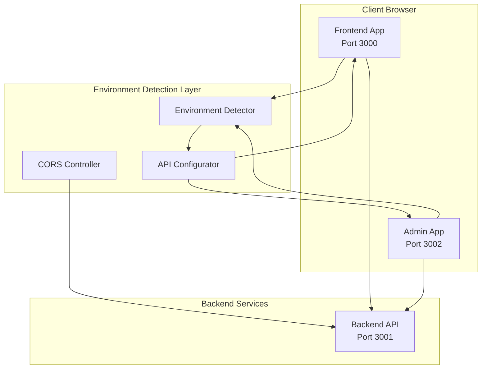
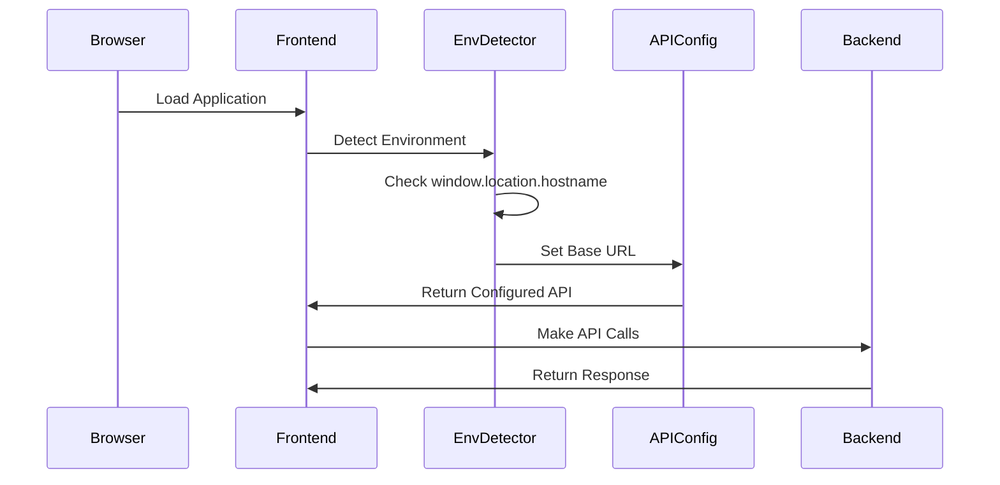

# Design Document: Domain Compatibility System

## Overview

The Domain Compatibility System provides automatic environment detection and dynamic API configuration for the Amazon Seller Central clone application. The system ensures seamless operation across localhost development and domain-based production environments without requiring code changes or manual configuration.

The design implements a runtime detection mechanism that identifies the deployment context and configures API endpoints dynamically. This approach maintains the existing three-service architecture (frontend:3000, backend:3001, backend-admin:3002) while enabling flexible deployment scenarios.

## Architecture

### High-Level Architecture



### Component Interaction Flow



## Components and Interfaces

### Environment Detection Component

**Purpose**: Automatically detect whether the application is running in localhost or domain mode.

**Location**: 
- Frontend: `src/utils/environmentDetector.ts`
- Backend-Admin: `src/utils/environmentDetector.ts`

**Interface**:
```typescript
interface EnvironmentDetector {
  detectEnvironment(): EnvironmentType;
  isLocalhost(): boolean;
  getCurrentDomain(): string;
  getProtocol(): 'http' | 'https';
}

type EnvironmentType = 'localhost' | 'domain';
```

**Implementation Strategy**:
- Use `window.location.hostname` to detect current hostname
- Check against localhost patterns: 'localhost', '127.0.0.1', '::1'
- Support both HTTP and HTTPS protocols
- Handle port detection automatically

### API Configuration Component

**Purpose**: Dynamically configure API base URLs based on detected environment.

**Location**:
- Frontend: `src/config/api.ts` (modify existing)
- Backend-Admin: `src/config/api.ts` (modify existing)

**Interface**:
```typescript
interface APIConfiguration {
  getBaseURL(): string;
  getEndpoints(): APIEndpoints;
  validateConnection(): Promise<boolean>;
}

interface APIEndpoints {
  auth: string;
  dashboard: string;
  products: string;
  sales: string;
  stores: string;
  // ... existing endpoints
}
```

**Configuration Logic**:
- Localhost mode: `http://localhost:3001`
- Domain mode: `${protocol}://${hostname}:3001`
- Maintain all existing endpoint paths
- Provide connection validation

### CORS Configuration Component

**Purpose**: Automatically configure backend CORS settings based on detected client origins.

**Location**: `backend/src/middleware/corsConfig.ts`

**Interface**:
```typescript
interface CORSConfiguration {
  getAllowedOrigins(): string[];
  configureCORS(): CorsOptions;
  addDynamicOrigin(origin: string): void;
}
```

**Implementation Strategy**:
- Detect incoming request origins
- Allow localhost origins: `http://localhost:3000`, `http://localhost:3002`
- Allow domain origins: `${protocol}://${hostname}:3000`, `${protocol}://${hostname}:3002`
- Maintain existing CORS security policies

### Configuration Injection Service

**Purpose**: Inject runtime configuration into applications without build-time dependencies.

**Location**: 
- Frontend: `src/services/configService.ts`
- Backend-Admin: `src/services/configService.ts`

**Interface**:
```typescript
interface ConfigurationService {
  initialize(): Promise<void>;
  getAPIConfig(): APIConfiguration;
  getEnvironmentInfo(): EnvironmentInfo;
  validateConfiguration(): Promise<ValidationResult>;
}

interface EnvironmentInfo {
  type: EnvironmentType;
  hostname: string;
  protocol: string;
  baseURL: string;
}
```

## Data Models

### Environment Configuration Model

```typescript
interface EnvironmentConfig {
  type: EnvironmentType;
  hostname: string;
  protocol: 'http' | 'https';
  ports: {
    frontend: number;
    backend: number;
    admin: number;
  };
  baseURLs: {
    backend: string;
  };
}
```

### API Configuration Model

```typescript
interface APIConfig {
  baseURL: string;
  timeout: number;
  retries: number;
  endpoints: Record<string, string>;
  headers: Record<string, string>;
}
```

### Validation Result Model

```typescript
interface ValidationResult {
  isValid: boolean;
  errors: string[];
  warnings: string[];
  connectionStatus: 'connected' | 'disconnected' | 'timeout';
  detectedEnvironment: EnvironmentType;
}
```

## Correctness Properties

*A property is a characteristic or behavior that should hold true across all valid executions of a system-essentially, a formal statement about what the system should do. Properties serve as the bridge between human-readable specifications and machine-verifiable correctness guarantees.*

### Property Reflection

After analyzing all acceptance criteria, I identified several areas where properties can be consolidated to eliminate redundancy:

- **Environment Detection**: Multiple criteria test the same detection logic across different contexts (1.1, 1.2, 9.1) - these can be combined into comprehensive detection properties
- **API Configuration**: Several criteria test URL construction and endpoint preservation (2.1, 2.2, 2.4, 2.5) - these can be unified into configuration properties  
- **CORS Handling**: Multiple criteria test origin handling (4.1, 4.2) - these can be combined into origin validation properties
- **Backward Compatibility**: Several criteria test API compatibility (7.1, 7.2, 7.3, 7.4, 7.5, 3.4, 3.5) - these can be consolidated into compatibility properties
- **Protocol Handling**: Multiple criteria test HTTP/HTTPS support (1.5, 4.4, 10.4) - these can be unified

The following properties provide comprehensive coverage while eliminating logical redundancy:

### Property 1: Environment Detection Accuracy
*For any* valid hostname (localhost variants, IP addresses, or domain names), the environment detection should correctly classify it as either 'localhost' or 'domain' type, regardless of protocol or port number
**Validates: Requirements 1.1, 1.2, 1.3, 1.4, 1.5**

### Property 2: API Configuration Consistency  
*For any* detected environment type, the API configuration should generate the correct base URL format (localhost:3001 for localhost environments, domain:3001 for domain environments) while preserving all existing endpoint paths
**Validates: Requirements 2.1, 2.2, 2.4, 2.5**

### Property 3: CORS Origin Validation
*For any* request origin that matches the detected environment pattern (localhost origins for localhost mode, domain origins for domain mode), the CORS configuration should allow the request while maintaining security policies
**Validates: Requirements 4.1, 4.2, 4.3, 4.4, 4.5**

### Property 4: Configuration Error Handling
*For any* configuration or connection failure, the system should provide specific error messages indicating the attempted operation and fall back to localhost mode with appropriate warnings
**Validates: Requirements 6.1, 6.2, 6.4, 6.5**

### Property 5: API Backward Compatibility
*For any* existing API call pattern, the domain compatibility system should maintain identical function signatures, request/response handling, error handling, and authentication flows regardless of environment
**Validates: Requirements 7.1, 7.2, 7.3, 7.4, 7.5, 3.2, 3.4, 3.5**

### Property 6: Domain Deployment Flexibility
*For any* valid domain name (including subdomains), protocol (HTTP/HTTPS), and port configuration, the system should correctly configure API endpoints and CORS settings without requiring code changes
**Validates: Requirements 10.1, 10.2, 10.3, 10.4**

### Property 7: Diagnostic Information Completeness
*For any* system startup or configuration validation, the diagnostic output should include environment detection results, configuration decisions, and connectivity status information
**Validates: Requirements 8.4, 8.5**

## Error Handling

### Error Categories

**Environment Detection Errors**:
- Invalid hostname formats
- Network connectivity issues during detection
- Browser API unavailability

**API Configuration Errors**:
- Backend service unavailability
- Invalid URL construction
- Timeout during connectivity validation

**CORS Configuration Errors**:
- Origin mismatch between client and server
- Protocol conflicts (HTTP/HTTPS mixing)
- Port accessibility issues

### Error Handling Strategy

**Graceful Degradation**:
- Fall back to localhost mode when environment detection fails
- Provide default configuration when dynamic configuration fails
- Maintain basic functionality even with partial failures

**User Feedback**:
- Clear error messages indicating specific failure points
- Diagnostic information for troubleshooting
- Startup warnings for configuration issues

**Logging and Monitoring**:
- Log all configuration decisions for debugging
- Track environment detection results
- Monitor API connectivity status

## Testing Strategy

### Dual Testing Approach

The testing strategy employs both unit tests and property-based tests to ensure comprehensive coverage:

**Unit Tests**: Focus on specific examples, edge cases, and integration points
- Test specific hostname patterns (localhost, 127.0.0.1, example.com)
- Test error conditions and fallback scenarios  
- Test integration between components
- Verify specific API endpoint configurations

**Property Tests**: Verify universal properties across all inputs using **fast-check** for TypeScript
- Generate random hostnames and verify correct environment detection
- Generate random domain configurations and verify API URL construction
- Test CORS configuration with various origin patterns
- Validate backward compatibility across different environment configurations

### Property-Based Testing Configuration

- **Library**: fast-check (TypeScript/JavaScript property testing library)
- **Iterations**: Minimum 100 iterations per property test
- **Test Tags**: Each property test references its design document property
  - Format: **Feature: domain-compatibility-system, Property {number}: {property_text}**

### Test Coverage Requirements

**Environment Detection Testing**:
- Property tests for hostname classification accuracy
- Unit tests for specific localhost patterns and edge cases
- Integration tests for browser environment detection

**API Configuration Testing**:
- Property tests for URL construction across environments
- Unit tests for endpoint preservation and error handling
- Integration tests for actual API connectivity

**CORS Configuration Testing**:
- Property tests for origin validation logic
- Unit tests for specific origin patterns and security policies
- Integration tests for cross-origin request handling

**Backward Compatibility Testing**:
- Property tests for API interface preservation
- Unit tests for specific authentication and error handling flows
- Integration tests for existing component functionality

Each correctness property must be implemented by a single property-based test that validates the universal behavior across all valid inputs, while unit tests handle specific examples and edge cases that demonstrate correct behavior in known scenarios.