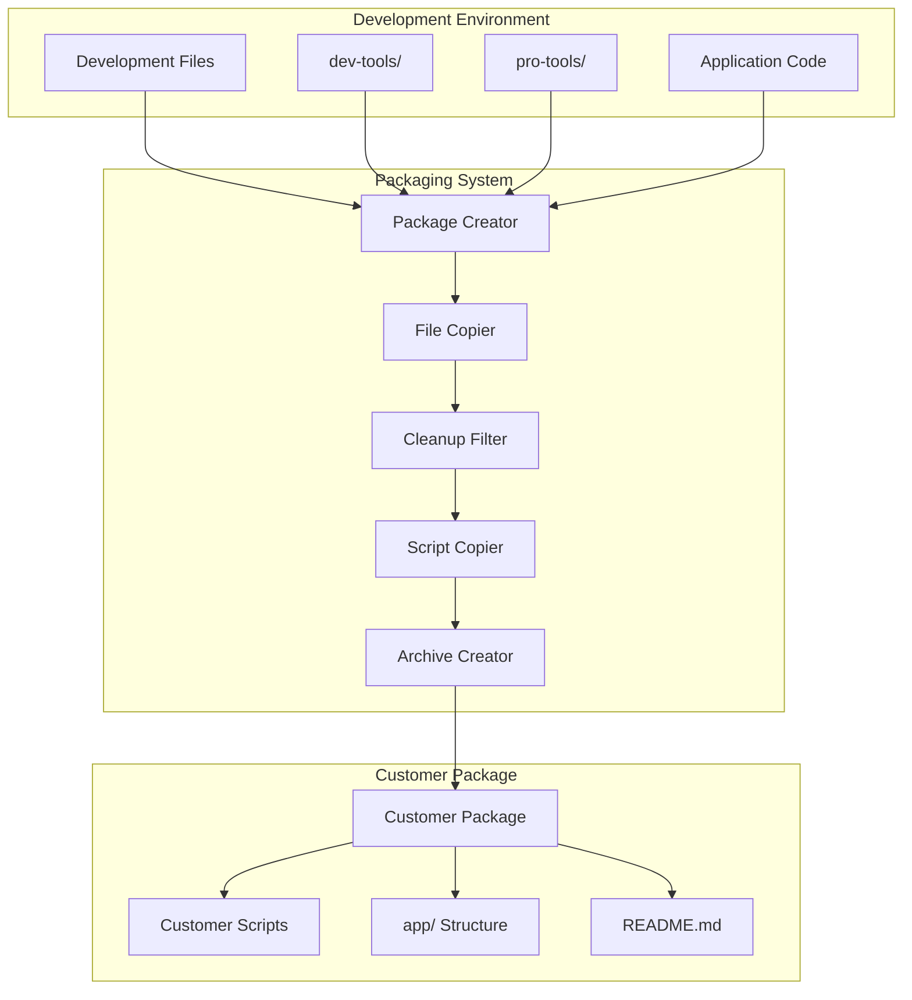
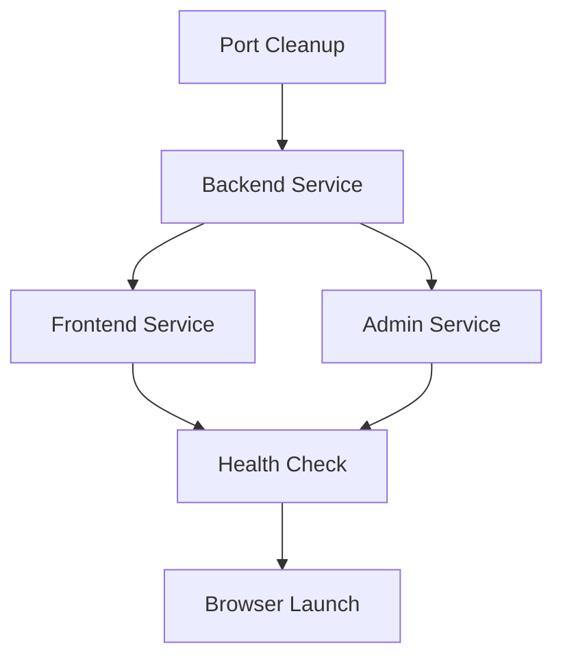

# Design Document: Project Packaging System

## Overview

The Project Packaging System is a comprehensive solution for creating clean, optimized customer distribution packages from a development environment. The system automates the separation of development tools from customer-ready files, implements robust path resolution, and provides a seamless installation and startup experience for end users.

The design follows a clear separation of concerns: development tools remain in the development environment, while customer packages contain only production-ready files with optimized scripts for installation, service management, and troubleshooting.

## Architecture

### High-Level Architecture



### Component Architecture

The system consists of four main components:

1. **Development Environment Manager**: Maintains separation between dev-tools and pro-tools
2. **Package Creator**: Orchestrates the packaging process
3. **File Processor**: Handles file copying, filtering, and optimization
4. **Customer Experience Manager**: Provides installation, startup, and troubleshooting capabilities

## Components and Interfaces

### Development Environment Manager

**Purpose**: Maintains clean separation between development and customer files

**Key Responsibilities**:
- Organize development tools in dev-tools directory
- Organize customer scripts in pro-tools directory
- Prevent cross-contamination between environments
- Validate directory structure integrity

**Interface**:
```typescript
interface DevelopmentEnvironmentManager {
  validateStructure(): ValidationResult;
  getDevToolsPath(): string;
  getProToolsPath(): string;
  getApplicationPaths(): string[];
}
```

### Package Creator

**Purpose**: Orchestrates the complete packaging workflow

**Key Responsibilities**:
- Create temporary packaging directory
- Coordinate file copying and filtering
- Generate customer documentation
- Create compressed archives
- Clean up temporary files

**Interface**:
```typescript
interface PackageCreator {
  createPackage(config: PackageConfig): PackageResult;
  generateTimestamp(): string;
  createArchive(sourcePath: string, targetPath: string): boolean;
  cleanup(tempPath: string): void;
}
```

### File Processor

**Purpose**: Handles intelligent file copying and filtering

**Key Responsibilities**:
- Copy application files to package structure
- Filter out development-specific files
- Preserve production dependencies
- Optimize package size

**Filtering Rules**:
- **Exclude**: node_modules, dist, build, .git, .env.local, test files
- **Include**: package.json, source code, configuration files, data files
- **Transform**: Update paths for customer environment

**Interface**:
```typescript
interface FileProcessor {
  copyApplicationFiles(source: string, target: string): void;
  applyDevelopmentFilter(path: string): boolean;
  optimizePackageSize(packagePath: string): OptimizationResult;
}
```

### Customer Experience Manager

**Purpose**: Provides comprehensive customer installation and management tools

**Components**:

1. **Installation Manager**
   - Node.js environment detection
   - Dependency installation with retry logic
   - Security software conflict detection
   - Desktop shortcut creation

2. **Service Manager**
   - Port conflict resolution
   - Service startup orchestration
   - Health monitoring
   - Browser integration

3. **Troubleshooting Manager**
   - System diagnostics
   - Network connectivity testing
   - Dependency repair
   - Report generation

**Interface**:
```typescript
interface CustomerExperienceManager {
  install(config: InstallConfig): InstallResult;
  launch(services: ServiceConfig[]): LaunchResult;
  troubleshoot(issue: TroubleshootingRequest): DiagnosticReport;
}
```

## Data Models

### Package Configuration

```typescript
interface PackageConfig {
  packageName: string;
  timestamp: string;
  sourceDirectories: string[];
  excludePatterns: string[];
  includePatterns: string[];
  outputPath: string;
  compressionLevel: number;
}
```

### Customer Package Structure

```typescript
interface CustomerPackageStructure {
  root: {
    scripts: ['install.bat', 'launcher.bat', 'troubleshoot.bat'];
    documentation: ['README.md'];
    assets: ['logs-001.ico'];
  };
  app: {
    backend: ApplicationModule;
    frontend: ApplicationModule;
    backendAdmin: ApplicationModule;
  };
}
```

### Service Configuration

```typescript
interface ServiceConfig {
  name: string;
  port: number;
  startCommand: string;
  workingDirectory: string;
  healthCheckUrl?: string;
  dependencies: string[];
}
```

### Installation Result

```typescript
interface InstallResult {
  success: boolean;
  nodeJsDetected: boolean;
  dependenciesInstalled: DependencyStatus[];
  shortcutCreated: boolean;
  warnings: string[];
  errors: string[];
}
```

## Path Resolution Strategy

### Development Environment Paths
- **dev-tools/**: Development-only scripts and utilities
- **pro-tools/**: Customer-ready scripts (copied to package root)
- **backend/**, **frontend/**, **backend-admin/**: Application modules

### Customer Package Paths
- **Root**: Customer scripts (install.bat, launcher.bat, troubleshoot.bat)
- **app/**: All application code in standardized structure
- **app/backend/**, **app/frontend/**, **app/backend-admin/**: Application modules

### Path Resolution Rules
1. All customer scripts use `%~dp0` for script directory resolution
2. Application paths always reference `app\` subdirectory
3. Relative paths maintained for cross-platform compatibility
4. Special character handling for international installations

## Service Startup Orchestration

### Startup Sequence
1. **Pre-flight Checks**: Node.js detection, port availability
2. **Port Cleanup**: Terminate conflicting processes
3. **Backend Startup**: Start API server (port 3001)
4. **Frontend Startup**: Start static file server (port 3000)
5. **Admin Startup**: Start admin panel server (port 3002)
6. **Health Verification**: Verify all services responding
7. **Browser Launch**: Open application URLs

### Service Dependencies


## Error Handling Strategy

### Installation Error Handling
- **Node.js Missing**: Provide download links and installation instructions
- **Network Issues**: Retry with different registries, offline mode guidance
- **Permission Errors**: Administrator privilege detection and guidance
- **Security Software**: Detection and whitelist instructions

### Runtime Error Handling
- **Port Conflicts**: Automatic cleanup and retry
- **Service Failures**: Individual service restart capabilities
- **Path Issues**: Robust path resolution with fallbacks
- **Dependency Corruption**: Automatic reinstallation options

### Troubleshooting Capabilities
- **System Diagnostics**: Environment, permissions, network
- **Service Health**: Port status, process monitoring
- **Dependency Verification**: Package integrity checks
- **Report Generation**: Comprehensive diagnostic reports

## Security Considerations

### File System Security
- Validate all file paths to prevent directory traversal
- Sanitize user input in batch scripts
- Use temporary directories with appropriate permissions
- Clean up sensitive temporary files

### Network Security
- Use HTTPS registries when available
- Validate downloaded packages
- Implement retry limits to prevent DoS
- Secure local service bindings

### Script Security
- Minimize elevated privileges requirements
- Validate environment variables
- Escape special characters in paths
- Implement timeout mechanisms

## Performance Optimization

### Package Size Optimization
- Exclude unnecessary development files
- Compress archives with optimal settings
- Remove duplicate dependencies
- Minimize script overhead

### Installation Performance
- Parallel dependency installation where possible
- Local caching of frequently used packages
- Progress reporting for long operations
- Efficient file copying algorithms

### Startup Performance
- Optimized service startup sequence
- Minimal startup dependencies
- Efficient port conflict resolution
- Fast health check implementations

## Correctness Properties

*A property is a characteristic or behavior that should hold true across all valid executions of a system—essentially, a formal statement about what the system should do. Properties serve as the bridge between human-readable specifications and machine-verifiable correctness guarantees.*

### Property 1: Development Environment Isolation
*For any* development environment modification, the customer package creation process should remain unaffected and produce identical results regardless of changes to dev-tools content.
**Validates: Requirements 1.2, 1.5**

### Property 2: Package Structure Consistency
*For any* customer package created, the package should contain the standardized app/ directory structure with backend, frontend, and backend-admin subdirectories, and customer scripts should be placed in the root directory.
**Validates: Requirements 1.3, 1.4, 4.1, 4.2, 4.4, 4.5**

### Property 3: Development File Exclusion
*For any* customer package created, the package should not contain any development-specific files including node_modules, dist/build directories, development configuration files, test files, or upload directories.
**Validates: Requirements 3.1, 3.2, 3.3, 3.4, 3.5**

### Property 4: Production File Preservation
*For any* customer package created, all necessary production files including package.json files, source code, and configuration files should be preserved while maintaining the correct directory structure.
**Validates: Requirements 2.2, 3.6, 9.4**

### Property 5: Packaging Automation Completeness
*For any* packaging command execution, the system should automatically create a complete customer package with timestamped naming, compressed archive format, and proper cleanup of temporary files.
**Validates: Requirements 2.1, 2.5, 2.6, 2.7**

### Property 6: Node.js Environment Detection
*For any* customer installation environment, the install script should correctly detect the presence or absence of Node.js and provide appropriate responses (proceed with installation or provide guidance).
**Validates: Requirements 5.1, 5.2**

### Property 7: Dependency Installation Completeness
*For any* customer package installation, all required dependencies should be installed automatically with proper error handling for network issues and security software conflicts.
**Validates: Requirements 5.3, 5.4, 5.5**

### Property 8: Service Orchestration
*For any* launcher execution, all application services (backend, frontend, admin) should start in the correct dependency order with port conflict resolution, proper initialization timing, and browser integration.
**Validates: Requirements 6.1, 6.2, 6.3, 6.4, 6.5, 6.6**

### Property 9: Robust Path Handling
*For any* installation path (including paths with spaces, special characters, or non-ASCII characters), the customer scripts should resolve all paths correctly relative to the script location and maintain proper working directories.
**Validates: Requirements 7.1, 7.2, 7.3, 7.4, 7.5**

### Property 10: Comprehensive Error Handling
*For any* error condition during installation or operation, the customer scripts should provide specific error messages, diagnostic capabilities, repair options, and support report generation.
**Validates: Requirements 8.1, 8.2, 8.3, 8.4, 8.5, 8.6**

### Property 11: Package Optimization
*For any* customer package created, the package should be optimized for size through file exclusion and compression while maintaining full functionality and reporting size metrics.
**Validates: Requirements 9.1, 9.2, 9.3, 9.5**

### Property 12: Version Management Consistency
*For any* package creation session, each package should have a unique timestamp, consistent naming conventions, version metadata, and support for multiple simultaneous versions.
**Validates: Requirements 10.1, 10.2, 10.3, 10.4, 10.5**

### Property 13: Installation Verification
*For any* completed installation, the system should verify that all components are properly installed, create desktop shortcuts, and confirm installation success before completion.
**Validates: Requirements 5.6, 5.7**

### Property 14: Customer Package Completeness
*For any* customer package created, the package should include all required customer scripts (install.bat, launcher.bat, troubleshoot.bat), comprehensive documentation (README.md), and only production-ready scripts from pro-tools.
**Validates: Requirements 2.4, 4.3**

## Testing Strategy

### Dual Testing Approach

The Project Packaging System requires both unit testing and property-based testing to ensure comprehensive coverage:

**Unit Tests** focus on:
- Specific file filtering scenarios (e.g., exact node_modules exclusion)
- Error message content validation
- Desktop shortcut creation verification
- Specific path resolution edge cases
- Integration points between packaging components

**Property Tests** focus on:
- Universal properties across all packaging scenarios
- Comprehensive input coverage through randomization
- Cross-platform path handling validation
- Service orchestration under various system states
- Package structure consistency across different source configurations

### Property-Based Testing Configuration

**Testing Framework**: Use fast-check for JavaScript/TypeScript property-based testing
**Test Configuration**: Minimum 100 iterations per property test
**Test Tagging**: Each property test must reference its design document property

**Tag Format**: `Feature: project-packaging-system, Property {number}: {property_text}`

**Example Property Test Structure**:
```typescript
// Feature: project-packaging-system, Property 3: Development File Exclusion
test('customer packages exclude all development files', () => {
  fc.assert(fc.property(
    fc.record({
      sourceDir: fc.string(),
      devFiles: fc.array(fc.string()),
      prodFiles: fc.array(fc.string())
    }),
    (config) => {
      const package = createCustomerPackage(config);
      return !containsAnyDevFiles(package, config.devFiles);
    }
  ), { numRuns: 100 });
});
```

### Testing Coverage Requirements

**Unit Test Coverage**:
- File system operations (copy, delete, compress)
- Script execution and error handling
- Path resolution edge cases
- Network connectivity scenarios
- Security software detection

**Property Test Coverage**:
- Package structure validation across all inputs
- File filtering consistency across all source configurations
- Path handling robustness across all installation locations
- Service startup reliability across all system states
- Error handling completeness across all failure modes

### Integration Testing

**End-to-End Scenarios**:
- Complete packaging workflow from development environment to customer installation
- Cross-platform compatibility testing (Windows variations)
- Network failure recovery testing
- Security software interaction testing
- Multi-version package coexistence testing

**Performance Testing**:
- Package creation time optimization
- Installation speed benchmarking
- Service startup performance validation
- Memory usage during packaging operations